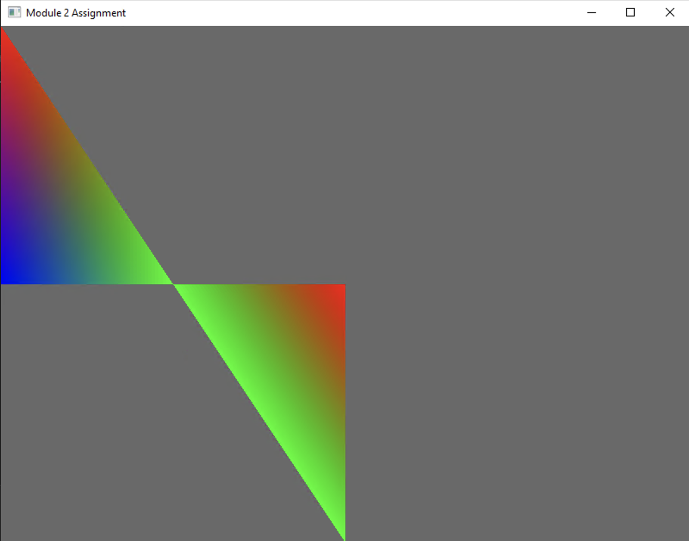
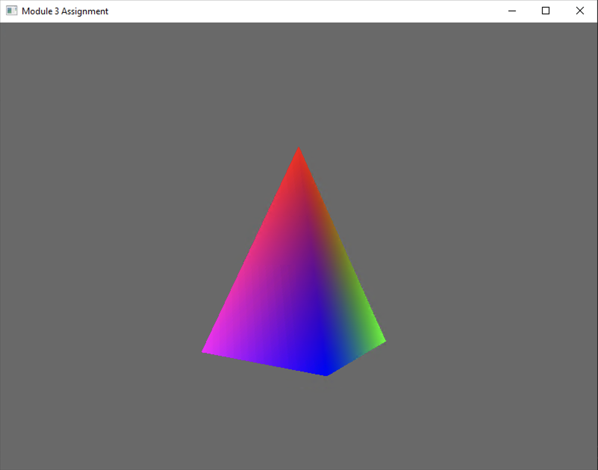
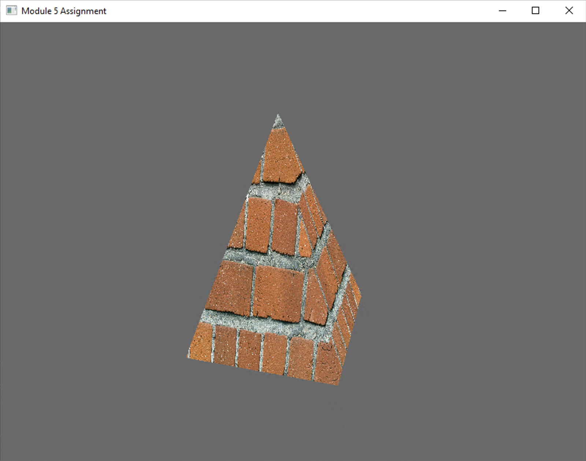
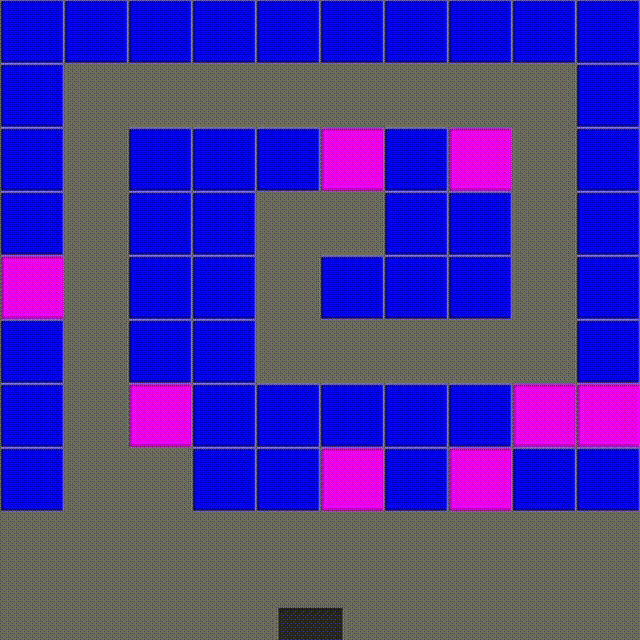

# CS-330-Tutorials-and-Assignments

These files contain the tutorials and assignments from SNHU's CS-330 course on computational graphics and visualization using C++ and OpenGL.

- [Module 2](#module-2-assignment)
- [Module 3](#module-3-assignment)
- [Module 4](#module-4-assignment)
- [Module 5](#module-5-assignment)
- [Module 6](#module-6-assignment)
- [Module 8](#module-8-assignment)

## [Module 2 Assignment](../module02assignment)

The goal of this assignment is to write commented modern OpenGL code that creates two right-angle triangles.

## [Module 3 Assignment](../module03assignment)

The goal of this assignment is to write commented modern OpenGL code to create a 3D pyramid.

## [Module 4 Assignment](../module04assignment)

The goal of this assignment is to write commented modern OpenGL code that allows for panning, zooming, and orbiting a pyramid. Use the keyboard, mouse, and movement combinations below:

- WASD keys: These keys should be used to control the forward, backward, left, and right motion.
- QE keys: These keys should be used to control the upward and downward movement.
- Mouse cursor: This should be used to change the orientation of the camera so it can look up and down or left and right. Mouse scroll: This should be used to adjust the speed of the movement, or the speed the camera travels around the scene.

## [Module 5 Assignment](../module05assignment)

The goal of this assignment is to write commented modern OpenGL code to apply texture to a 3D pyramid.

- WASD keys: These keys should be used to control the forward, backward, left, and right motion.
- QE keys: These keys should be used to control the upward and downward movement.
- Mouse cursor: This should be used to change the orientation of the camera so it can look up and down or left and right. Mouse scroll: This should be used to adjust the speed of the movement, or the speed the camera travels around the scene.

## [Module 6 Assignment](../module06assignment)

The goal of this assignment is to create two lights and place them at different angles relative to your completed pyramid. Give the key light an intensity of 100% and the fill light an intensity of 10%. Then, apply a greenish color to the key light.

- LK keys: Start/stop light orbit
- WASD keys: These keys should be used to control the forward, backward, left, and right motion.
- QE keys: These keys should be used to control the upward and downward movement.
- Mouse cursor: This should be used to change the orientation of the camera so it can look up and down or left and right. Mouse scroll: This should be used to adjust the speed of the movement, or the speed the camera travels around the scene.

## [Module 8 Assignment](../module08assignment)

The goal of this assignment is to manipulate the provided code in a number of different ways and explain the changes made to the code ([explanation of changes](Module%208%20Assignment.pdf)).

- Arrange the bricks into an organizational structure that promotes engagement with the animation
- Apply physics laws to the circles
- Alter the state of the bricks upon collision
- Alter the state of the circles upon collision

